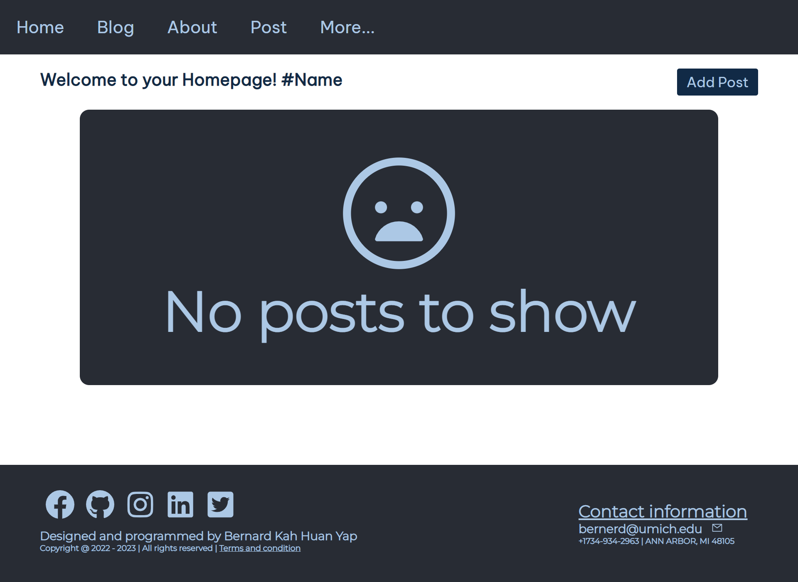
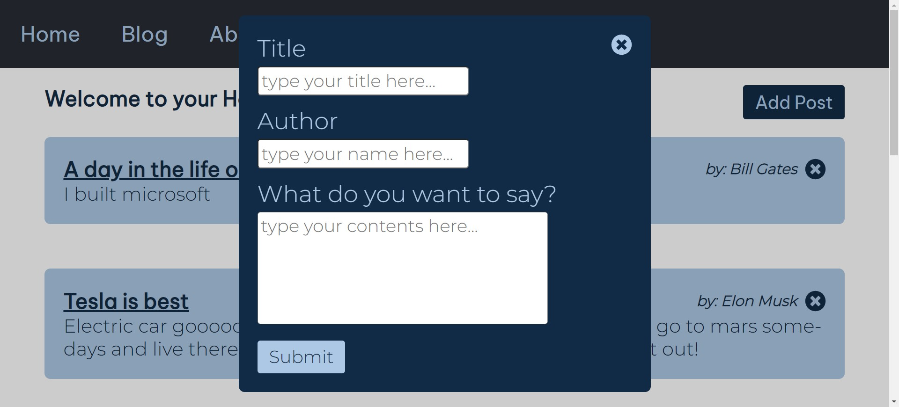

# blog-app
https://blog-post-app-bernard.herokuapp.com/ (note Heroku goes afk for free tier, so it might take some time to load the website)
 
Blog post app created by Bernard Yap 
 

<h1>
This is the UI when there's no post yet

This is the UI when there's post(s)

This is the little pop-up menu after clicked "Add Post"

</h1>

